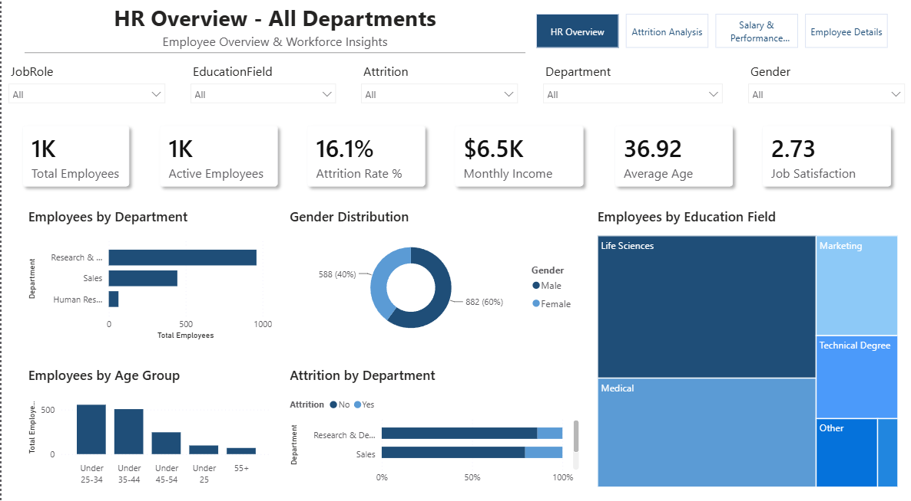
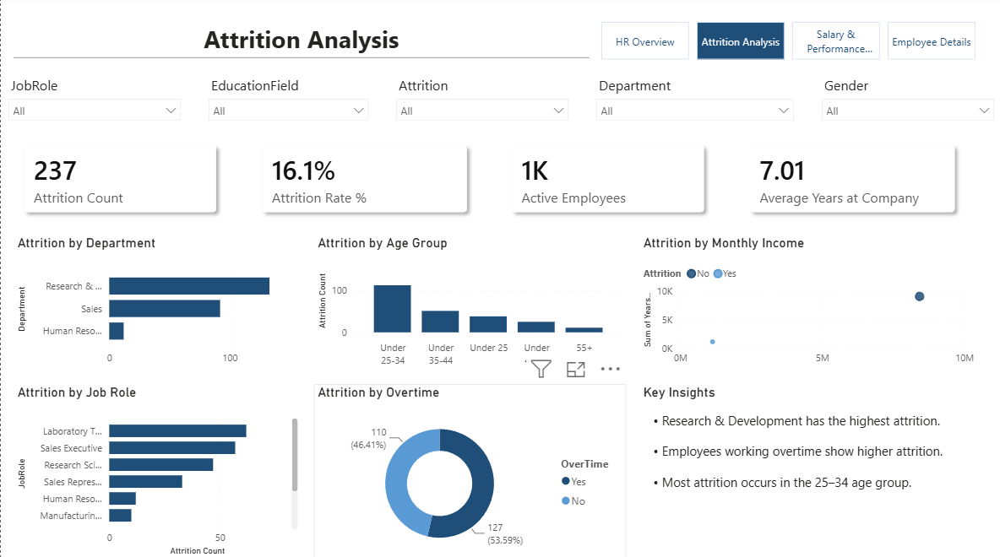
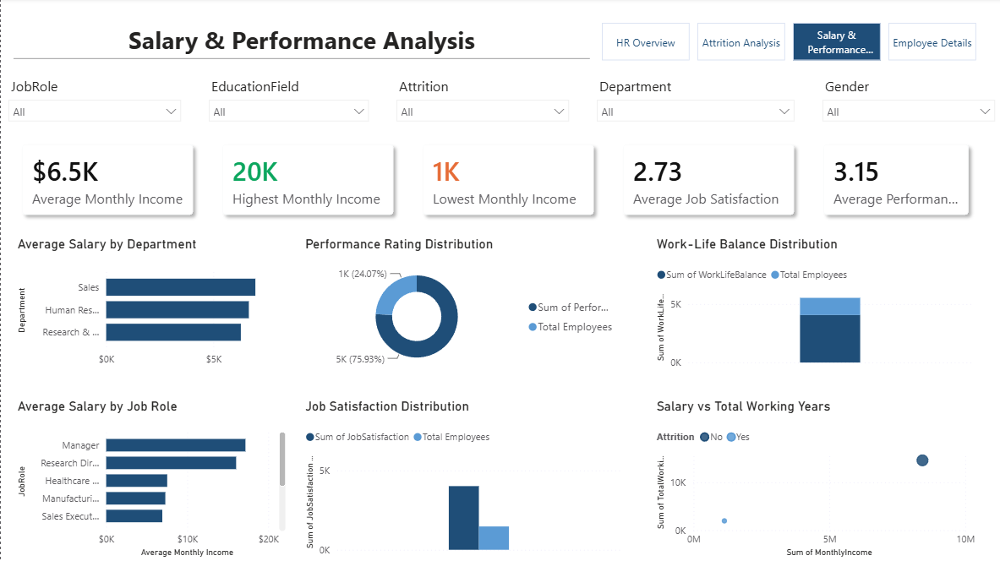
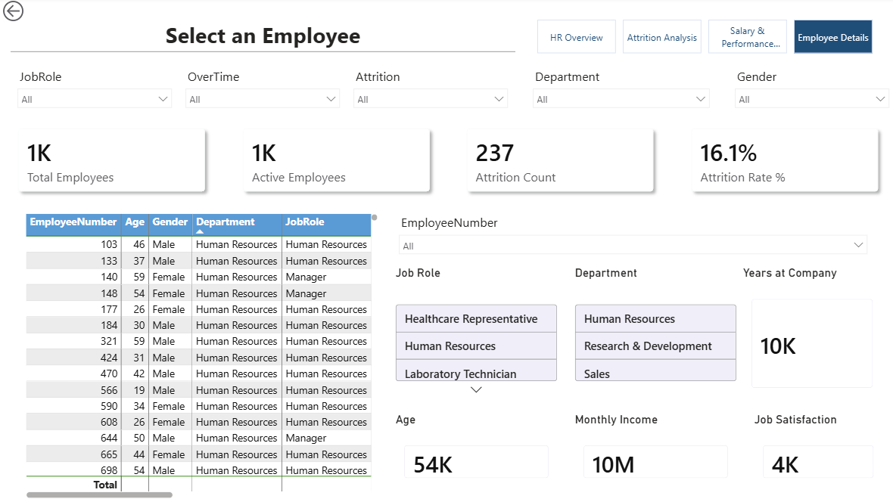

# HR-Analytics-PowerBI
Interactive HR Analytics Dashboard built with Microsoft Power BI to analyze employee attrition, workforce trends, compensation, performance, and employee satisfaction.
# HR Analytics Dashboard

## Project Overview

This project is an interactive HR Analytics Dashboard developed using Microsoft Power BI.

It helps analyze employee data across:

- Employee Attrition
- Departments
- Job Roles
- Employee Demographics
- Salary & Compensation
- Job Satisfaction
- Performance
- Work-Life Balance
- Overtime

---

## Dashboard Features

- KPI Cards
- HR Overview Dashboard
- Attrition Analysis
- Salary & Performance Analysis
- Employee Details
- Dynamic Report Titles
- Custom Tooltips
- Interactive Slicers
- Synced Slicers
- Conditional Formatting
- Page Navigation
- DAX Measures
- Data Modeling

---

## Tools Used

- Microsoft Power BI Desktop
- Power Query
- DAX
- Data Modeling

---

## Dataset

IBM HR Analytics Employee Attrition & Performance Dataset

---

## Dashboard Preview

### HR Overview

### Attrition Analysis

### Salary & Performance

### Employee Details

---

## Author

Preethi Kumar
